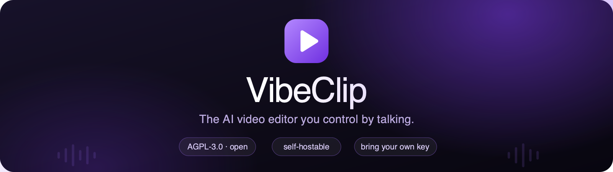
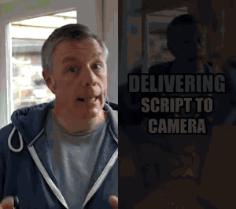

<div align="center">



<br/>

[](LICENSE)


[](CONTRIBUTING.md)

**Drop in a long video — podcast, interview, talk, stream — and VibeClip cuts it into
vertical, captioned, ready-to-post shorts.** Then you refine every clip by *chatting*:
*“make clip 2 punchier,” “bigger captions,” “add a zoom at 0:05,” “undo.”*

[Quick start](#-quick-start) · [Features](#-what-it-does) · [How it works](#-how-it-works) · [Bring your own key](#-bring-your-own-key-byok) · [Configuration](#-configuration) · [Contributing](#-contributing)

<br/>



<sub><b>Left:</b> the raw clip. <b>Right:</b> after one sentence — <i>“make it mrbeast style and add gameplay underneath”</i> — captioned, reframed to 9:16, and split-screened. Real pipeline output, not a mockup.<br>Footage: Andy Dickinson (CC-BY) · gameplay: Orbital - No Copyright Gameplay (CC-BY) · Minecraft © Mojang.</sub>

</div>

---

## ⚡ Quick start

Spin up a private instance in three commands. All you add is **one** LLM key.

```bash
git clone https://github.com/oktaydbk54/vibeclip.git
cd vibeclip
cp .env.example .env          # add ONE line: OPENAI_API_KEY=sk-...
docker compose up -d --build
# → open http://localhost:8765
```

With the defaults (`EMAIL_MODE=console`, `REQUIRE_EMAIL_VERIFICATION=false`) sign-up logs
you straight in — no email provider needed. Bring an **OpenAI** or **DeepSeek** key
(DeepSeek is the cheap one), or point `LLM_BASE_URL` at any OpenAI-compatible server
(Ollama, LM Studio, OpenRouter…). Prefer no Docker? See [local install](#run-without-docker).

---

## ✨ What it does

|  |  |
|---|---|
| 🎬 **Long → shorts, automatically** | Transcribes on-device, scores the strongest moments (hook / flow / value — not a dumb keyword scan), reframes to 9:16 around the speaker, and burns word-synced captions. |
| 💬 **Edit by chatting** | A tool-calling agent turns plain language into real edits — trims, filler-word removal (“uhh”/“ee”), zooms, styles, music, b-roll, brand overlays. One **undo** reverts a whole multi-step plan. |
| 🎨 **Styles in one shot** | `hormozi`, `mrbeast`, `podcast_minimal`, `kinetic` — captions, pace, zoom, music and SFX applied together. Drop in your own preset as a JSON file. |
| 🖥️ **A real studio UI** | Web app with a live 9:16 preview, clip cards, a CapCut-style timeline, and the chat copilot right beside it. |
| 🔑 **Your key, your data** | Bring your own LLM key (OpenAI · Gemini · Claude · DeepSeek · any compatible endpoint). Nothing is proxied through us — there is no “us.” |
| 🏠 **Self-host first** | One Docker command. Speech-to-text and every render run **locally** via faster-whisper + ffmpeg. AGPL-3.0, no SaaS lock-in. |

---

## 🛠 How it works

```
        upload
          │
   ┌──────▼───────┐   faster-whisper (local, no API key)
   │  transcribe  │
   └──────┬───────┘
   ┌──────▼────────────┐   LLM "brain" (your key) — structure + scored moments
   │ analyze structure │
   │  find highlights  │
   └──────┬────────────┘
   ┌──────▼───────┐   per clip, replayed from cached intermediates (~2–4s/edit)
   │  auto edit   │  jumpcut → 9:16 reframe → captions → music+ambience (ducked)
   │              │  → SFX → fades   ·   then your chat commands layer on top
   └──────┬───────┘
        export  →  vertical MP4, publish-ready
```

Only **two** things ever hit the network: your chosen **LLM** (to understand intent and
score moments) and, optionally, **Pexels** (stock b-roll). Speech-to-text and all
rendering stay on your machine.

---

## 🔑 Bring your own key (BYOK)

VibeClip never ships with a key and never proxies your prompts anywhere except the
provider *you* choose. Two ways to supply one:

- **Per instance** — set `OPENAI_API_KEY` (or `DEEPSEEK_API_KEY`, or any
  OpenAI-compatible endpoint via `LLM_BASE_URL`) in `.env`.
- **Per user** — each account pastes its own key on the in-app **Settings** page, with a
  live *test-connection*. Keys are **encrypted at rest** and never sent back to the browser.

| Provider | Routed via | Notes |
|---|---|---|
| **OpenAI** | native | Default, best-supported. |
| **DeepSeek** | native | The budget pick — a typical short costs a few cents. |
| **Google Gemini** | OpenAI-compat endpoint | `gemini-2.5-flash` / `pro`. |
| **Anthropic Claude** | OpenAI-compat endpoint | `claude-haiku` / `sonnet`. |
| **Anything else** | `LLM_BASE_URL` | Ollama, LM Studio, OpenRouter, your own proxy… |

Speech-to-text runs locally and needs **no** key.

---

## ⚙️ Configuration

Everything is driven by `.env` (see `.env.example` for the full, commented list). The ones
that matter most:

| Variable | Default | Purpose |
|---|---|---|
| `OPENAI_API_KEY` | — | Your LLM key (preferred). |
| `DEEPSEEK_API_KEY` | — | Cheaper fallback, used if no OpenAI key. |
| `LLM_BASE_URL` | — | Any OpenAI-compatible endpoint (local models, proxies). |
| `EMAIL_MODE` | `console` | `console` prints OTP to the log; `resend` sends real email. |
| `REQUIRE_EMAIL_VERIFICATION` | `false` | `true` enforces email confirmation (public instances). |
| `HOSTED_STUDIO` | `true` | `true` = the landing offers login/signup (use your own instance). `false` = a public marketing site that points everyone to GitHub to self-host (no login). |
| `GA_MEASUREMENT_ID` | — | Empty = **no analytics** injected (self-host default). |
| `SITE_URL` | `http://localhost:8765` | Public base URL for blog canonical/OG/sitemap. |
| `VIDEO_ENCODER` | `libx264` | Use `h264_videotoolbox` on Apple Silicon. |
| `VIBECLIP_BIND` | `127.0.0.1` | docker-compose publish address (`0.0.0.0` to expose). |
| `MAX_UPLOAD_SECONDS` | `0` | Longest uploadable video, seconds. `0` = no limit (self-host). |
| `MAX_PROJECTS_PER_USER` | `0` | Projects per account. `0` = unlimited; cap it on a public instance. |

### Run without Docker

Requirements: **Python 3.12+**, **ffmpeg**, and the DejaVu fonts (for caption rendering).

```bash
cp .env.example .env          # add your LLM key
uv sync                       # or: pip install -e .
python -m chat.app            # → http://127.0.0.1:8765
```

First run downloads the Whisper model. Prefer the terminal? `python -m chat.cli <video.mp4>`.

### 🤖 Connect an AI agent (MCP)

VibeClip is also an **MCP server**: an external agent (Claude Code, Cursor, Codex)
can drive a whole project — open a source video, generate clips, edit the timeline,
and export — using the **same 60+ tools** the web UI and built-in chat agent use.

```bash
# Claude Code
claude mcp add vibeclip -- python /path/to/shorts-mcp/server.py
```

The agent gets `list_projects`, `open_project`, `project_state`, plus the full
editing surface (`generate_clips`, `set_cut`, `add_zoom`, `set_subtitles`,
`add_broll`, `set_dub`, `export_clip`, `undo`, …). Each editing tool takes a
`project` id (from `list_projects` / `open_project`) followed by its own args.
Typical flow: `open_project(video_path)` → `generate_clips(project)` →
edit tools → `export_clip(project, clip_id)`. Edits load the project fresh from
disk per call and roll back on error, so they interleave safely with the web app.

Quick check the server is wired up:

```bash
python server.py --selftest <video.mp4>   # prints the registered tool count
```

---

## 📦 Bundled assets & licensing

The repo bundles a small library of royalty-free media (music, ambience, SFX, demo
footage) for the built-in styles. Some tracks are **CC-BY** (Kevin MacLeod) and require
crediting in your video description — see the `CREDITS` files under `assets/`. VibeClip
**never** bundles or uses copyrighted/branded game footage.

## 🤝 Contributing

Issues and PRs welcome — start with [`CONTRIBUTING.md`](CONTRIBUTING.md). Security reports:
see [`SECURITY.md`](SECURITY.md). Be excellent to each other ([code of conduct](CODE_OF_CONDUCT.md)).

## 📄 License

**GNU AGPL-3.0** — see [`LICENSE`](LICENSE). You can self-host and modify VibeClip freely;
if you run a modified version as a network service, you must offer that modified source to
its users. Copyright © 2026 the VibeClip authors.

<div align="center"><sub>Built for people who'd rather <b>talk</b> to their editor than fight it.</sub></div>
